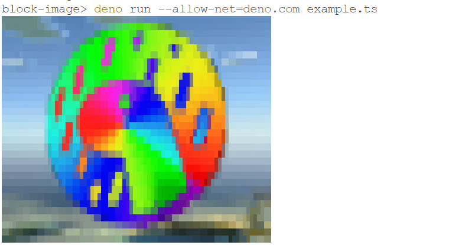

# block-image

Display an image using block elements on terminal.

Here is an example which downloads an image, resizes the image and mirrors the
pixels as block elements:

```ts
// External imports for handling JPEG images
import { resize } from "https://deno.land/x/deno_image@0.0.4/mod.ts";
import { decode } from "https://deno.land/x/jpegts@1.1/mod.ts";

// Import
import { Image } from "jsr:@sauber/block-image@1.0.2";

// Download image
const url = "https://deno.com/images/artwork/deno_minecraft.jpg";
const data = (await fetch(url)).arrayBuffer();
const originalJPEG = new Uint8Array(await data);

// Identify source dimensions
const img = decode(originalJPEG);
const width: number = img.width;
const height: number = img.height;

// Decide target dimensions. Cols is doubled because of half-width terminal chars.
const lines = 16;
const rows: number = lines * 2;
const cols: number = Math.round((width / height) * rows) * 2;

// Resize downloaded image to target dimensions
const resizedJPEG = await resize(originalJPEG, {
  width: cols,
  height: rows,
  aspectRatio: false, // because half-width chars
});

// Import resized image
const rawData = decode(resizedJPEG).data;
const image = new Image(cols, rows, rawData);

// Display image as terminal block elements
console.log(image.toString());
```

Output should look something like this:


